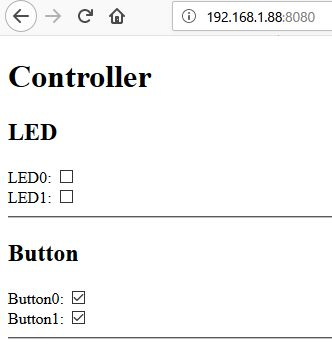
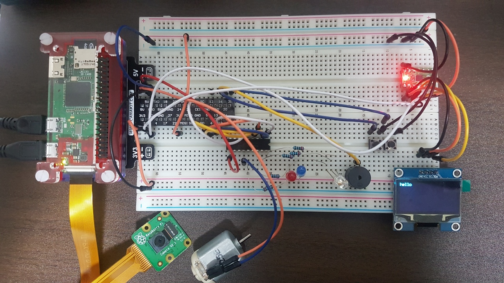
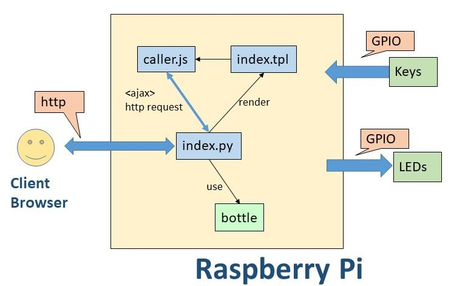
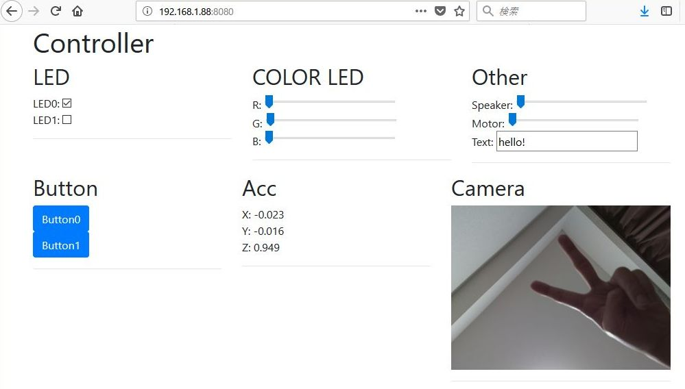

# Device Control Server with Raspberry Pi
This is a typical raspberry pi project to control peripheral devices such as LED, Button from a web application.

# Environment
- Raspberry Pi Zero W
	- assume the IP address of pi as 192.168.1.88 in this project
- A transistor array(TD62083AP) is connected between pi and, LEDs and a motor

# A_Basic
This is the most simple project (The below picture has more devices for the following project). Web server and device driver are implemented in python. Target devices are:
- LEDs (GPIO.OUT)
- Buttons (GPIO.IN)




## Structure
<br>

### Server side
- index.py
	- powered by bottle.py
	- provides Web APIs (JSON format) to access device
	- device driver like implementation is also here

### Client side
- view/index.tpl
	- when a user accesses root URL, the server returns index.tpl
	- index.tpl has control view
- static/js/caller.js
	- procedure to access the server using Ajax
	- updates button status at regular interval

## Typical control flow
1. A user accesses http://192.168.1.88:8080/
2. Web server (index.py) returns index.tpl
3. The user changes LED button in the browser
4. Javascript code is called (onclick event)
5. Javascript code calls the web api (http://192.168.1.88:8080/setLed) using Ajax
6. The server accept the api call, then turns on/off LED

## How to use
```
python index.py
(need to install wiringPi)
```

# B_Advanced
This is the project with more functions. Device driver is implemented in C. Python accesses the C functions via ctypes. Also, camera image is displayed in the controller view. Target devices are:
- LEDs (GPIO.OUT)
- Motor (GPIO.SOFTPWM)
- Speaker (GPIO.SOFTPWM)
- OLED Display (I2C)
- Buttons (GPIO.IN)
- Accelerometer (I2C)
- Camera (CSI-2)  
(All the device drivers except for camera is implemented in C)

<br>

## Structure
<br>

### Server side
- index.py
	- powered by bottle.py
	- provides Web APIs (JSON format) to access device
	- captures camera image and save it to a jpeg file
	- accesses device drivers implemented in C using ctypes
- myCLib/*.c
	- device drivers
	- generate *.so library which is called from python code

### Client side
- view/index.tpl
	- when a user accesses root URL, the server returns index.tpl
	- index.tpl has control view
	- powered by bootstrap (not mandatory)

- static/js/caller.js
	- procedure to access the server using Ajax
	- updates device status at regular interval
	- update camera image by retrieving the jpeg file from the server

## Typical control flow
1. A user accesses http://192.168.1.88:8080/
2. Web server (index.py) returns index.tpl
3. The user changes LED button
4. Javascript code collects all the status to control device such as LEDs and a motor at regular interval
	- do not use event as it causes many API calls
5. Then, Javascript code calls the web api (http://192.168.1.88:8080/setDeviceStatus) using Ajax
6. The server accepts the api call, then calls device driver to update all the output devices

## How to use
```
sudo apt-get install libi2c-dev
cd myClib
make
cd ../
python index.py  
(need to install wiringPi)
```

# Memo
Debug command for web api
```
curl -H "Accept: application/json" -H "Content-type: application/json" -X POST -d '{"num":"0", "onoff":true}' http://192.168.1.88:8080/setLed
```